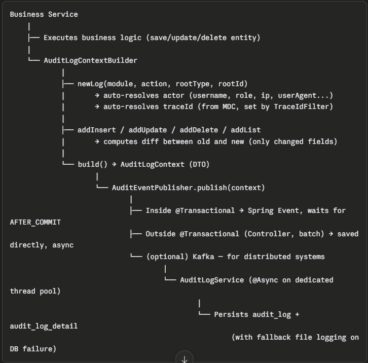

Audit Log Module Overview
Purpose
Records the history of business actions (create, approve, issue number, update, delete) across the system, enabling traceability, history lookup, and compliance auditing.

Architecture
Business Service

(with fallback file logging on DB failure)

Data Schema
audit_log — one record per business action: 
id, trace_id, module, action, root_type, root_id,
actor_info (CLOB JSON), description, endpoint, created_at
audit_log_detail — N records for entities affected within one action:
id, audit_log_id, object_type, object_id, action (INSERT/UPDATE/DELETE),
changed_data (CLOB JSON), created_at

Key Features
1. Smart diff, no redundant storage

INSERT → stores the full new object as a flat map
DELETE → stores the full object before deletion as a flat map
UPDATE → stores only changed fields, formatted as {field: {old, new}}
DiffOptions allows customization: treat null as equal to "", ignore system fields (id, createdAt...), compare values as strings

2. Support for one-to-many relationships

addList() automatically diffs old vs new lists, classifying each item as INSERT/UPDATE/DELETE
Suited for business cases like a case record (danh bản) having multiple charges (tội danh) or multiple sanctions (hình thức xử lý)

3. Flexible builder, composable across methods/services

Builder is a static nested class with no dependency on the outer instance, so it can be freely passed as a parameter between methods/services
Allows a single complex business transaction (affecting multiple tables) to be recorded as one audit_log with multiple audit_log_detail records

4. Asynchronous, non-blocking for business logic

Dedicated thread pool (auditLogExecutor) configurable via application.yml
CallerRunsPolicy when the queue is full — prevents log loss
@TransactionalEventListener(AFTER_COMMIT) — only logs after the business transaction successfully commits, avoiding "phantom" logs on rollback

5. Resilient to failure

Try/catch with fallback file logging if persisting the audit log to the database fails
Graceful shutdown handling (waitForTasksToCompleteOnShutdown, awaitTerminationSeconds)

6. End-to-end traceability (traceId)

TraceIdFilter sets a traceId in MDC for every incoming request
Auto-generates a new traceId when running outside HTTP scope (batch jobs, scheduled tasks)

7. Pluggable publishing backend

Defaults to Spring's ApplicationEventPublisher
Can switch to Kafka via configuration (audit.publisher.type=kafka) without changing business logic code